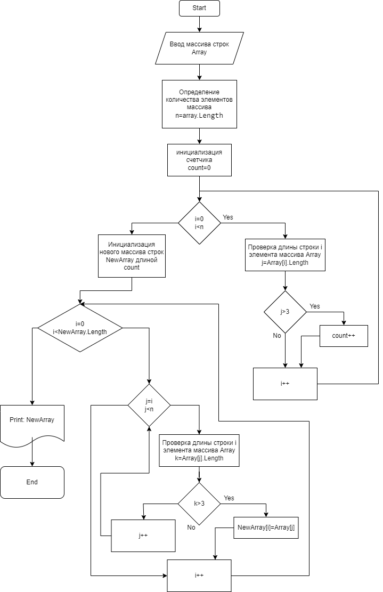

# **Итоговая проверочная работа.**
Данная работа необходима для проверки ваших знаний и навыков по иrогу прохождения первого блока обучения на программе разработчик. Мы должны убедиться что базовое знакомство с it прошло успешно.
----
Задача алгоритмически не самая сложная, однако для полноценного вьmолнения проверочной работы необходимо:
1. Создать репозиrорий на GitНub
2. Нарисовать блок-схему алгоритма (можно обойтись блок-схемой основной содержательной части, если вы
выделяете ее в отдельный :метод)
3. Снабдить репозиторий оформленным текстовым: описанием решения ( файл READМE.md)
4. Написать программу, решающую поставленную задачу
5. Использовать контроль версий в работе над этим небольшим проектом (не должно быть так что все залито одним коммитом, как минимум этапы 2, 3 и 4 должны быть расположены в разных коммитах)
---
**Задача:** Написать программу, которая из имеющегося массива строк формирует массив из строк, длина которых меньше либо равна 3 символа. Первоначальный массив можно ввести с клавиатуры, либо задать на старте вьmолнения алгоритма. При решении не рекомендуетеся пользоваться коллекциями, лучше обойтись исключительно массивами.

Примеры:
*["hello", "2", "world", ":-)"] -> ["2", ":-)"]
["1234", "1567", "-2", "computer science"] -> ["-2"]
["Russia", "Denrnark", "Кazan"] -> []*

---

**Решение**

1. Для решения поставленной задичи необходимо с начала составить блок-схему с алгоритмом решения.

В ходе решения поставленной задачи я сначала в первм цикле определил необходимую длину массива в первом цикле. В следующем цикле выполненно заполнение нового массива строкоми длиной равной или меньшей 3.
2. По составленной блок-схеме составляем программу на языке программирования C#.